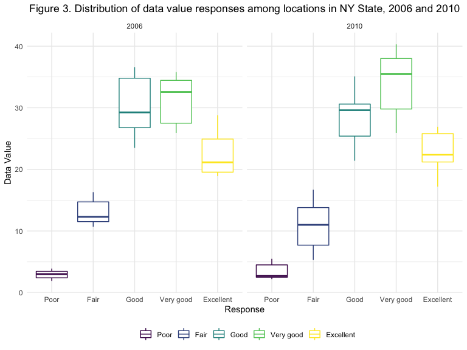

Data Science Homework \#3
================
Sophia Miller
10/6/2019

# Problem 1

## Loading Instacart data

``` r
library(p8105.datasets)
data("instacart")
```

## Description of Instacart Dataset

The dataset used here is a cleaned and limited subset of the original
Instacart data. Each row in this dataset represents a single product
from an Instacart order. There are 1384617 rows and 15 columns in the
dataset. Each observation has an order identifier (`order_id`), product
identifier (`product_id`), and customer identifier (`user_id`). Key
variables include `reordered`, which indicates if the product has been
ordered by the customer in the past month, `order_dow`, which indicates
which day of the week the order was placed, `days_since_prior_order`,
which indicates the number of days since the customer’s last order, and
`product_name`, which is the name of the product ordered. For example,
the mean number of days between orders is 17, the mean hour of the day
during which products from the ice cream aisle were ordered is 14
(2:00PM), and the total number of products ordered from the “specialty
cheeses” aisle in the dataset is 3873.

## Exploratory data analysis of Instacart data

There are 134 aisles in the dataset, and the most items are ordered from
the “fresh vegetables”
aisle.

### The following plot shows the numbers of items ordered from each aisle (limited to aisles with more than 10,000 items ordered):

``` r
instacart %>% 
  group_by(aisle) %>% 
  summarize(
    n_items_ordered = n()) %>% 
  mutate(aisle = reorder(aisle, n_items_ordered)) %>% 
  filter(n_items_ordered > 10000) %>% 
  ggplot(aes(x = aisle, y = n_items_ordered)) + theme(axis.text.x = element_text(angle = 45, hjust = 1)) + geom_col() + ggtitle("Figure 1. Number of items ordered per aisle") + theme(plot.title = element_text(hjust = 0.5))
```


``` r
## comment on results of this and other tables/figures??
```

### The following table shows the three most popular items in the “baking ingredients”, “dog food care”, and “packaged fruits and vegetables” aisles:

``` r
instacart %>% 
  group_by(product_name, aisle) %>%
  summarize(
    n_items_ordered = n()
    ) %>% 
  group_by(aisle) %>% 
  filter(
    aisle %in% c("baking ingredients","dog food care", "packaged vegetables fruits"),
    min_rank(desc(n_items_ordered)) < 4) %>% 
  arrange(n_items_ordered, aisle) %>% 
  knitr::kable(format = 'pandoc', caption = "Table 1. Most popular items by aisle")
```

| product\_name                                 | aisle                      | n\_items\_ordered |
| :-------------------------------------------- | :------------------------- | ----------------: |
| Small Dog Biscuits                            | dog food care              |                26 |
| Organix Chicken & Brown Rice Recipe           | dog food care              |                28 |
| Snack Sticks Chicken & Rice Recipe Dog Treats | dog food care              |                30 |
| Cane Sugar                                    | baking ingredients         |               336 |
| Pure Baking Soda                              | baking ingredients         |               387 |
| Light Brown Sugar                             | baking ingredients         |               499 |
| Organic Blueberries                           | packaged vegetables fruits |              4966 |
| Organic Raspberries                           | packaged vegetables fruits |              5546 |
| Organic Baby Spinach                          | packaged vegetables fruits |              9784 |

Table 1. Most popular items by
aisle

### The following table shows the mean time of day that pink lady apples and coffee ice cream were ordered on each day of the week:

``` r
instacart %>% 
  filter(product_name %in% c("Pink Lady Apples", "Coffee Ice Cream")) %>% 
  mutate(order_dow = as.factor(order_dow)) %>% 
  arrange(order_dow) %>% 
  mutate(Day = recode(order_dow, '0' = "Sunday", '1' = "Monday", '2' = "Tuesday", '3' = "Wednesday", '4' = "Thursday", '5' = "Friday", '6' = "Saturday")) %>% 
  group_by(product_name, Day) %>% 
  summarize(mean_hour = mean(order_hour_of_day)) %>% 
  pivot_wider(
    names_from = product_name,
    values_from = mean_hour) %>% 
  knitr::kable(format = 'pandoc', caption = "Table 2. Mean hour of day of item order, by day of week", digits = 0)
```

| Day       | Coffee Ice Cream | Pink Lady Apples |
| :-------- | ---------------: | ---------------: |
| Sunday    |               14 |               13 |
| Monday    |               14 |               11 |
| Tuesday   |               15 |               12 |
| Wednesday |               15 |               14 |
| Thursday  |               15 |               12 |
| Friday    |               12 |               13 |
| Saturday  |               14 |               12 |

Table 2. Mean hour of day of item order, by day of
week

``` r
## convert hour to time variable, convert day number to day name directly
```

# Problem 2

## Loading BRFSS data

``` r
library(p8105.datasets)
data("brfss_smart2010") 
```

## Cleaning BRFSS data

``` r
brfss_data = brfss_smart2010 %>% 
  janitor::clean_names() %>% 
  separate(locationdesc, c("state", "county")) %>% 
  filter(topic == "Overall Health") %>% 
  mutate(response = 
           factor(response, c("Poor", "Fair", "Good", "Very good", "Excellent"))) %>% 
  select(-locationabbr)
```

## Exploratory data analysis of BRFSS data

### Which states were observed at 7 or more locations?

``` r
brfss_data %>% 
  filter(year == "2002") %>% 
  group_by(state) %>% 
  summarize(
  n_counties = n_distinct(county)) %>% 
  filter(n_counties >= 7) %>% 
knitr::kable(format = 'pandoc', caption = "Table 3. States observed in 7 or more counties")
```

| state | n\_counties |
| :---- | ----------: |
| FL    |           7 |
| MA    |           8 |
| NC    |           7 |
| NJ    |           8 |
| PA    |          10 |

Table 3. States observed in 7 or more counties

``` r
brfss_data %>% 
  filter(year == "2010") %>% 
  group_by(state) %>% 
  summarize(
  n_counties = n_distinct(county)) %>% 
  filter(n_counties >= 7) %>% 
knitr::kable(format = 'pandoc', caption = "Table 4. States observed in 7 or more counties")
```

| state | n\_counties |
| :---- | ----------: |
| CA    |           9 |
| CO    |           7 |
| FL    |          40 |
| MA    |           9 |
| MD    |          11 |
| NC    |          12 |
| NE    |          10 |
| NJ    |          19 |
| NY    |           9 |
| OH    |           8 |
| PA    |           7 |
| SC    |           7 |
| TX    |          16 |
| WA    |          10 |

Table 4. States observed in 7 or more counties

## BRFSS Subset

``` r
brfss_subset = brfss_data %>% 
  filter(response == "Excellent") %>% 
    select(year, state, data_value) %>%
  group_by(state, year) %>%
  mutate(mean_data_value = mean(data_value, na.rm = TRUE)) %>% 
  select(-data_value) %>% 
  distinct(.keep_all = TRUE)

ggplot(brfss_subset, aes(x = year, y = mean_data_value)) + geom_line(aes(group = state, color = state))
```


## Two-panel plot

``` r
brfss_data %>% 
  filter(year %in% c("2006", "2010")) %>%
  select(year, state, response, data_value) %>%
  ggplot(aes(x = response, y = data_value)) + geom_boxplot(aes(color = response)) + facet_grid(~year)
```



# Problem 3

## Load and clean accelerometer data

``` r
accel_data = read_csv(file = "./data/accel_data.csv") %>% 
  janitor::clean_names() %>%
   pivot_longer(
    activity_1:activity_1440,
    names_to = "minute",
    values_to = "activity") %>% 
  mutate(
    weekday_vs_weekend = if_else(day %in% c("Monday", "Tuesday", "Wednesday", "Thursday", "Friday"), "weekday", day), 
    weekday_vs_weekend = if_else(weekday_vs_weekend %in% c("Saturday", "Sunday"), "weekend", weekday_vs_weekend),
    day =  factor(day, c("Monday", "Tuesday", "Wednesday", "Thursday", "Friday", "Saturday", "Sunday"))
    ) %>% 
separate(minute, c("activity_value", "minute")) %>% 
select(-activity_value) %>% 
  mutate(
    minute = as.numeric(minute)
    )
```

    ## Parsed with column specification:
    ## cols(
    ##   .default = col_double(),
    ##   day = col_character()
    ## )

    ## See spec(...) for full column specifications.

# Aggregating total activity across each day

``` r
accel_data %>% 
  group_by(week, day) %>% 
  mutate(total_activity = sum(activity)) %>% 
  select(week, day, total_activity) %>% 
  distinct(.keep_all = TRUE) %>% 
  arrange(week, day) %>% 
  knitr::kable(format = 'pandoc', caption = "Table 5. Total Activity by Day and Week")
```

| week | day       | total\_activity |
| ---: | :-------- | --------------: |
|    1 | Monday    |        78828.07 |
|    1 | Tuesday   |       307094.24 |
|    1 | Wednesday |       340115.01 |
|    1 | Thursday  |       355923.64 |
|    1 | Friday    |       480542.62 |
|    1 | Saturday  |       376254.00 |
|    1 | Sunday    |       631105.00 |
|    2 | Monday    |       295431.00 |
|    2 | Tuesday   |       423245.00 |
|    2 | Wednesday |       440962.00 |
|    2 | Thursday  |       474048.00 |
|    2 | Friday    |       568839.00 |
|    2 | Saturday  |       607175.00 |
|    2 | Sunday    |       422018.00 |
|    3 | Monday    |       685910.00 |
|    3 | Tuesday   |       381507.00 |
|    3 | Wednesday |       468869.00 |
|    3 | Thursday  |       371230.00 |
|    3 | Friday    |       467420.00 |
|    3 | Saturday  |       382928.00 |
|    3 | Sunday    |       467052.00 |
|    4 | Monday    |       409450.00 |
|    4 | Tuesday   |       319568.00 |
|    4 | Wednesday |       434460.00 |
|    4 | Thursday  |       340291.00 |
|    4 | Friday    |       154049.00 |
|    4 | Saturday  |         1440.00 |
|    4 | Sunday    |       260617.00 |
|    5 | Monday    |       389080.00 |
|    5 | Tuesday   |       367824.00 |
|    5 | Wednesday |       445366.00 |
|    5 | Thursday  |       549658.00 |
|    5 | Friday    |       620860.00 |
|    5 | Saturday  |         1440.00 |
|    5 | Sunday    |       138421.00 |

Table 5. Total Activity by Day and
Week

``` r
#which variables should be included in addition to total_activity? Should we just observe trends or do an analysis?
```

# Time plot
