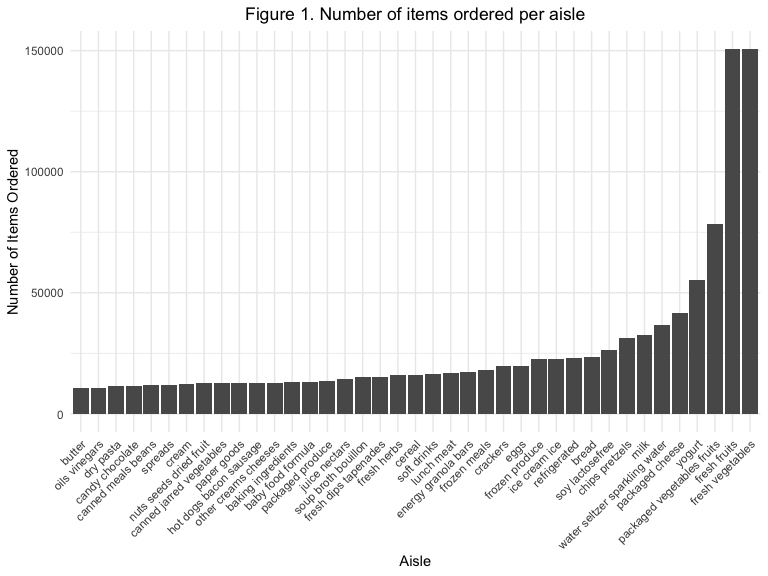

Data Science Homework \#3
================
Sophia Miller
10/6/2019

# Initial Set Up

# Problem 1

## Loading Instacart data

``` r
library(p8105.datasets)
data("instacart")
```

## Description of Instacart Dataset

The dataset used here is a cleaned and limited subset of the original
Instacart data. Each row in this dataset represents a single product
from an Instacart order. There are 1384617 rows and 15 columns in the
dataset. Each observation has an order identifier (`order_id`), product
identifier (`product_id`), and customer identifier (`user_id`). Key
variables include `reordered`, which indicates if the product has been
ordered by the customer in the past month, `order_dow`, which indicates
which day of the week the order was placed, `days_since_prior_order`,
which indicates the number of days since the customer’s last order, and
`product_name`, which is the name of the product ordered. For example,
the mean number of days between orders is 17.0661259.

## Exploratory data analysis of Instacart data

``` r
instacart %>% 
 summarize(
   n_aisles = n_distinct(aisle_id))
```

    ## # A tibble: 1 x 1
    ##   n_aisles
    ##      <int>
    ## 1      134

``` r
## change this to inline r code?
```

There are 134 aisles in the Instacart dataset.

``` r
names(which.max(table(pull(instacart, aisle))))
```

    ## [1] "fresh vegetables"

``` r
## return top three aisles rather than top one
```

The most items are ordered from the Fresh Vegetables aisle.

## Plot aisle vs. number of items ordered

``` r
instacart %>% 
  group_by(aisle) %>% 
  summarize(
    n_items_ordered = n()) %>% 
  mutate(aisle = reorder(aisle, n_items_ordered)) %>% 
  filter(n_items_ordered > 10000) %>% 
  ggplot(aes(x = aisle, y = n_items_ordered)) + theme(axis.text.x = element_text(angle = 45, hjust = 1)) + geom_col() + ggtitle("Number of Items Ordered per Aisle") + theme(plot.title = element_text(hjust = 0.5))
```



## Make a table of three most popular items in “baking ingredients”, “dog food care”, and “packaged fruits and vegetables”

``` r
instacart %>% 
  group_by(aisle) %>%
    summarize(
    n_items_ordered = n())
```

    ## # A tibble: 134 x 2
    ##    aisle                  n_items_ordered
    ##    <chr>                            <int>
    ##  1 air fresheners candles            1067
    ##  2 asian foods                       7007
    ##  3 baby accessories                   306
    ##  4 baby bath body care                328
    ##  5 baby food formula                13198
    ##  6 bakery desserts                   1501
    ##  7 baking ingredients               13088
    ##  8 baking supplies decor             1094
    ##  9 beauty                             287
    ## 10 beers coolers                     1839
    ## # … with 124 more rows

``` r
## come back to this 
```

## Make a table showing mean time of day pink lady apples and coffee ice cream are ordered on each day of the week

``` r
instacart %>% 
  filter(product_name %in% c("Pink Lady Apples", "Coffee Ice Cream")) %>% 
  mutate(order_dow = as.factor(order_dow)) %>% 
  arrange(order_dow) %>% 
  mutate(Day = recode(order_dow, '0' = "Sunday", '1' = "Monday", '2' = "Tuesday", '3' = "Wednesday", '4' = "Thursday", '5' = "Friday", '6' = "Saturday")) %>% 
  group_by(product_name, Day) %>% 
  summarize(mean_hour = mean(order_hour_of_day)) %>% 
  pivot_wider(
    names_from = product_name,
    values_from = mean_hour) %>% 
  knitr::kable(format = 'pandoc', caption = "Table 1. Mean hour of day of item order, by day of week", digits = 0)
```

| Day       | Coffee Ice Cream | Pink Lady Apples |
| :-------- | ---------------: | ---------------: |
| Sunday    |               14 |               13 |
| Monday    |               14 |               11 |
| Tuesday   |               15 |               12 |
| Wednesday |               15 |               14 |
| Thursday  |               15 |               12 |
| Friday    |               12 |               13 |
| Saturday  |               14 |               12 |

Table 1. Mean hour of day of item order, by day of week

# Problem 2
