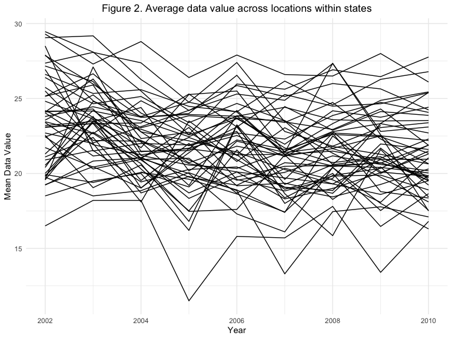
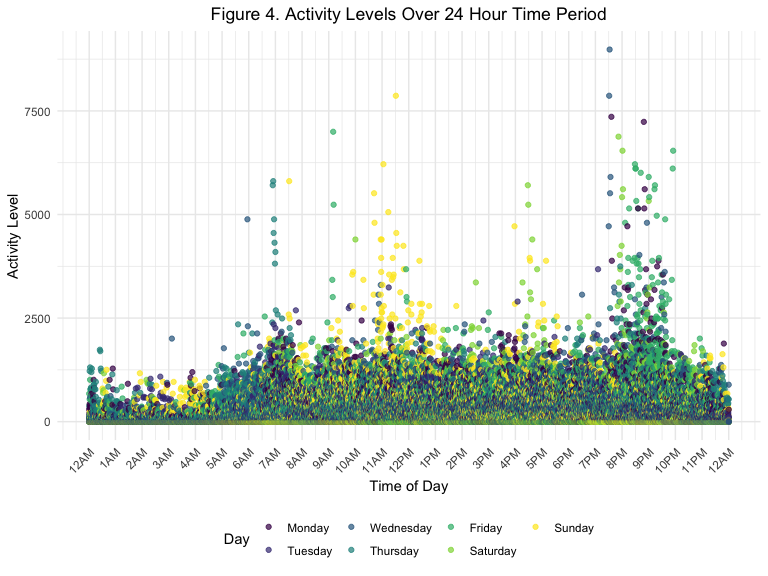

Data Science Homework \#3
================
Sophia Miller
10/14/2019

# Problem 1

## *Loading Instacart data*

``` r
library(p8105.datasets)
data("instacart")
```

## *Description of Instacart dataset*

The dataset used here is a cleaned and limited subset of the original
Instacart dataset. Each row in this dataset represents a single product
from an Instacart order. There are 1384617 rows and 15 columns in the
dataset. Each observation has an order identifier (`order_id`), product
identifier (`product_id`), and customer identifier (`user_id`). Key
variables include `reordered`, which indicates if the product has been
ordered by the customer in the past month, `order_dow`, which indicates
which day of the week the order was placed, `days_since_prior_order`,
which indicates the number of days since the customer’s last order, and
`product_name` and `aisle`, which are the name of the product ordered
and aisle from which it is ordered, respectively. For example, the mean
number of days between orders is 17, the mean hour of the day during
which products from the ice cream aisle were ordered is 14 (2:00PM), and
the total number of products ordered from the “specialty cheeses” aisle
in the dataset is 3873.

## *Exploratory analysis of Instacart dataset*

There are 134 aisles in the dataset, and the most items are ordered from
the “fresh vegetables” aisle.

The following plot shows the numbers of items ordered from each aisle
(limited to aisles with more than 10,000 items ordered):

``` r
instacart %>% 
  group_by(aisle) %>% 
  summarize(
    n_items_ordered = n()) %>% 
  mutate(
    aisle = reorder(aisle, n_items_ordered)) %>% 
  filter(
    n_items_ordered > 10000) %>% 
  ggplot(aes(x = aisle, y = n_items_ordered)) + 
  theme(axis.text.x = element_text(angle = 45, hjust = 1)) + 
  geom_col() + ylab("Number of Items Ordered") + xlab("Aisle") + 
  ggtitle("Figure 1. Number of items ordered per aisle") + 
  theme(plot.title = element_text(hjust = 0.5))
```


As we can see from the plot above, the “fresh vegetables” and “fresh
fruits” aisles are the most popular aisles, with approximately 150,000
items ordered from each. The least popular aisles are the “butter” and
“oils vinegars” aisles.

The following table shows the three most popular items in the “baking
ingredients”, “dog food care”, and “packaged fruits and vegetables”
aisles:

``` r
instacart %>% 
  group_by(product_name, aisle) %>%
  summarize(
    n_items_ordered = n()) %>% 
  group_by(aisle) %>% 
  filter(
    aisle %in% c("baking ingredients","dog food care", "packaged vegetables fruits"),
    min_rank(desc(n_items_ordered)) < 4) %>% 
  arrange(n_items_ordered, aisle) %>% 
  knitr::kable(format = 'pandoc', caption = "Table 1. Most popular items by aisle")
```

| product\_name                                 | aisle                      | n\_items\_ordered |
| :-------------------------------------------- | :------------------------- | ----------------: |
| Small Dog Biscuits                            | dog food care              |                26 |
| Organix Chicken & Brown Rice Recipe           | dog food care              |                28 |
| Snack Sticks Chicken & Rice Recipe Dog Treats | dog food care              |                30 |
| Cane Sugar                                    | baking ingredients         |               336 |
| Pure Baking Soda                              | baking ingredients         |               387 |
| Light Brown Sugar                             | baking ingredients         |               499 |
| Organic Blueberries                           | packaged vegetables fruits |              4966 |
| Organic Raspberries                           | packaged vegetables fruits |              5546 |
| Organic Baby Spinach                          | packaged vegetables fruits |              9784 |

Table 1. Most popular items by aisle

As we can see from the table above, the most popular item ordered from
the “dog food” aisle is snack sticks chicken & rice recipe dog treats,
the most popular item ordered from the “baking ingredients” aisle is
light brown sugar, and the most popular item ordered from the “packaged
fruits and vegetables” aisle is organic baby spinach.

The following table shows the mean time of day that pink lady apples and
coffee ice cream were ordered on each day of the week:

``` r
instacart %>% 
  filter(product_name %in% c("Pink Lady Apples", "Coffee Ice Cream")) %>% 
  mutate(
    order_dow = as.factor(order_dow)) %>% 
  arrange(order_dow) %>% 
  mutate(
    Day = recode(order_dow, '0' = "Sunday", '1' = "Monday", '2' = "Tuesday", '3' = "Wednesday", '4' = "Thursday", '5' = "Friday", '6' = "Saturday")) %>% 
  group_by(product_name, Day) %>% 
  summarize(
    mean_hour = mean(order_hour_of_day)) %>% 
  pivot_wider(
    names_from = product_name,
    values_from = mean_hour) %>% 
  knitr::kable(format = 'pandoc', caption = "Table 2. Mean hour of day of item order, by day of week", digits = 0)
```

| Day       | Coffee Ice Cream | Pink Lady Apples |
| :-------- | ---------------: | ---------------: |
| Sunday    |               14 |               13 |
| Monday    |               14 |               11 |
| Tuesday   |               15 |               12 |
| Wednesday |               15 |               14 |
| Thursday  |               15 |               12 |
| Friday    |               12 |               13 |
| Saturday  |               14 |               12 |

Table 2. Mean hour of day of item order, by day of week

As we can see from the table above, both coffee ice cream and pink lady
apples tend to be ordered in the afternoon, regardless of the day of the
week. On average, coffee ice cream is ordered between 12:00PM and
3:00PM, while pink lady apples are ordered between 11:00AM and 2:00PM.

# Problem 2

## *Loading BRFSS data*

``` r
library(p8105.datasets)
data("brfss_smart2010") 
```

## *Cleaning BRFSS data*

``` r
brfss_data = brfss_smart2010 %>% 
  janitor::clean_names() %>% 
  filter(
    topic == "Overall Health") %>% 
  mutate(
    response = factor(response, c("Poor", "Fair", "Good", "Very good", "Excellent"))) %>% 
  separate(
    locationdesc, c("state", "county")) %>% 
  select(-locationabbr)
```

## *Exploratory data analysis of BRFSS data*

Here, we can see which states were observed at 7 or more locations in
2002 and 2010:

``` r
brfss_data %>% 
  filter(
    year %in% c("2002", "2010")) %>% 
  group_by(state, year) %>% 
  summarize(
  n_counties = n_distinct(county)) %>% 
  filter(n_counties >= 7) %>% 
  arrange(year) %>% 
knitr::kable(format = 'pandoc', caption = "Table 3. States observed in 7 or more counties, 2002 and 2010")
```

| state | year | n\_counties |
| :---- | ---: | ----------: |
| FL    | 2002 |           7 |
| MA    | 2002 |           8 |
| NC    | 2002 |           7 |
| NJ    | 2002 |           8 |
| PA    | 2002 |          10 |
| CA    | 2010 |           9 |
| CO    | 2010 |           7 |
| FL    | 2010 |          40 |
| MA    | 2010 |           9 |
| MD    | 2010 |          11 |
| NC    | 2010 |          12 |
| NE    | 2010 |          10 |
| NJ    | 2010 |          19 |
| NY    | 2010 |           9 |
| OH    | 2010 |           8 |
| PA    | 2010 |           7 |
| SC    | 2010 |           7 |
| TX    | 2010 |          16 |
| WA    | 2010 |          10 |

Table 3. States observed in 7 or more counties, 2002 and 2010

According to the table above, there were 5 states observed at 7 or more
locations in 2002, and 14 states observed at 7 or more locations in
2010. In 2002, the state observed at the most locations was
Pennsylvania. In 2010, the state observed at the most locations was
Florida.

Here we are creating a subset of the BRFSS dataset that is limited to
only `Excellent` responses and contains the year and state variables as
well as a new variable that averages the `data_value` across locations
within a state, then plotting the average value over time within states:

``` r
brfss_subset = brfss_data %>% 
  filter(
    response == "Excellent") %>% 
    select(year, state, data_value) %>%
  group_by(state, year) %>%
  mutate(
    mean_data_value = mean(data_value, na.rm = TRUE)) %>%
  select(-data_value) %>% 
  distinct(.keep_all = TRUE)

ggplot(brfss_subset, aes(x = year, y = mean_data_value)) + 
  geom_line(aes(group = state)) + 
  ggtitle("Figure 2. Average data value across locations within states") + 
  theme(plot.title = element_text(hjust = 0.5)) +
  ylab("Mean Data Value") +
  xlab("Year")
```


According to Figure 2, the mean data value across states tends to fall
between 20 and 25.

The plot below shows the distribution of `data_value` responses among
locations in New York state in 2006 and 2010:

``` r
brfss_data %>% 
  filter(
    year %in% c("2006", "2010"), state %in% c("NY")) %>%
  select(year, state, response, data_value) %>%
  ggplot(aes(x = response, y = data_value)) + 
  geom_boxplot(aes(color = response)) + 
  facet_grid(~year) + 
  ggtitle("Figure 3. Distribution of data value responses among locations in NY State, 2006 and 2010") + 
  theme(plot.title = element_text(hjust = 0.5)) + 
  ylab("Data Value") +
  xlab("Response") +
  labs(color = "")
```


As we can see in Figure 3, the response with the hightest average data
value in 2006 was “very good”, while the response “good” had the widest
distribution. In 2010, the response “very good” had both the highest
average data value and widest distribution. In both 2006 and 2010, the
“very good” and “good” responses have the highest average data value,
while the “poor” and “fair” responses have the lowest average data
value.

# Problem 3

## *Loading and cleaning accelerometer data*

``` r
accel_data = read_csv(file = "./data/accel_data.csv") %>% 
  janitor::clean_names() %>%
  pivot_longer(
    activity_1:activity_1440,
    names_to = "minute",
    values_to = "activity") %>% 
  mutate(
    weekday_vs_weekend = if_else(day %in% c("Monday", "Tuesday", "Wednesday", "Thursday", "Friday"), "weekday", day), 
    weekday_vs_weekend = if_else(weekday_vs_weekend %in% c("Saturday", "Sunday"), "weekend", weekday_vs_weekend),
    day =  factor(day, c("Monday", "Tuesday", "Wednesday", "Thursday", "Friday", "Saturday", "Sunday")),
    ) %>%
  separate(minute, c("activity_value", "minute")) %>%
  select(-activity_value) %>% 
  mutate(minute = as.numeric(minute))
```

    ## Parsed with column specification:
    ## cols(
    ##   .default = col_double(),
    ##   day = col_character()
    ## )

    ## See spec(...) for full column specifications.

The accelerometer dataset has 50400 rows and 6 columns. The 6 variables
in the dataset include `week`, which indicates which of the four
observation weeks a particular observation comes from, `day_id`, which
is a unique identifier for each day during which data was collected,
`day`, which indicates day of the week, `minute` and `activity`, which
indicate the minute of the day for each data point and the activity
score for that minute, respectively, and `weekend_vs_weekday`, which
indicates if the day of observation was during the week or weekend.

# *Aggregating total activity across each day*

``` r
accel_data %>% 
  group_by(week, day) %>% 
  mutate(
    total_activity = sum(activity)) %>% 
  select(week, day, total_activity) %>% 
  distinct(.keep_all = TRUE) %>% 
  arrange(week, day) %>% 
  knitr::kable(format = 'pandoc', caption = "Table 4. Total activity by day and week")
```

|    week | day         |                                                                                                                                                                                                                                                                                                        total\_activity |
| ------: | :---------- | ---------------------------------------------------------------------------------------------------------------------------------------------------------------------------------------------------------------------------------------------------------------------------------------------------------------------: |
|       1 | Monday      |                                                                                                                                                                                                                                                                                                               78828.07 |
|       1 | Tuesday     |                                                                                                                                                                                                                                                                                                              307094.24 |
|       1 | Wednesday   |                                                                                                                                                                                                                                                                                                              340115.01 |
|       1 | Thursday    |                                                                                                                                                                                                                                                                                                              355923.64 |
|       1 | Friday      |                                                                                                                                                                                                                                                                                                              480542.62 |
|       1 | Saturday    |                                                                                                                                                                                                                                                                                                              376254.00 |
|       1 | Sunday      |                                                                                                                                                                                                                                                                                                              631105.00 |
|       2 | Monday      |                                                                                                                                                                                                                                                                                                              295431.00 |
|       2 | Tuesday     |                                                                                                                                                                                                                                                                                                              423245.00 |
|       2 | Wednesday   |                                                                                                                                                                                                                                                                                                              440962.00 |
|       2 | Thursday    |                                                                                                                                                                                                                                                                                                              474048.00 |
|       2 | Friday      |                                                                                                                                                                                                                                                                                                              568839.00 |
|       2 | Saturday    |                                                                                                                                                                                                                                                                                                              607175.00 |
|       2 | Sunday      |                                                                                                                                                                                                                                                                                                              422018.00 |
|       3 | Monday      |                                                                                                                                                                                                                                                                                                              685910.00 |
|       3 | Tuesday     |                                                                                                                                                                                                                                                                                                              381507.00 |
|       3 | Wednesday   |                                                                                                                                                                                                                                                                                                              468869.00 |
|       3 | Thursday    |                                                                                                                                                                                                                                                                                                              371230.00 |
|       3 | Friday      |                                                                                                                                                                                                                                                                                                              467420.00 |
|       3 | Saturday    |                                                                                                                                                                                                                                                                                                              382928.00 |
|       3 | Sunday      |                                                                                                                                                                                                                                                                                                              467052.00 |
|       4 | Monday      |                                                                                                                                                                                                                                                                                                              409450.00 |
|       4 | Tuesday     |                                                                                                                                                                                                                                                                                                              319568.00 |
|       4 | Wednesday   |                                                                                                                                                                                                                                                                                                              434460.00 |
|       4 | Thursday    |                                                                                                                                                                                                                                                                                                              340291.00 |
|       4 | Friday      |                                                                                                                                                                                                                                                                                                              154049.00 |
|       4 | Saturday    |                                                                                                                                                                                                                                                                                                                1440.00 |
|       4 | Sunday      |                                                                                                                                                                                                                                                                                                              260617.00 |
|       5 | Monday      |                                                                                                                                                                                                                                                                                                              389080.00 |
|       5 | Tuesday     |                                                                                                                                                                                                                                                                                                              367824.00 |
|       5 | Wednesday   |                                                                                                                                                                                                                                                                                                              445366.00 |
|       5 | Thursday    |                                                                                                                                                                                                                                                                                                              549658.00 |
|       5 | Friday      |                                                                                                                                                                                                                                                                                                              620860.00 |
|       5 | Saturday    |                                                                                                                                                                                                                                                                                                                1440.00 |
|       5 | Sunday      |                                                                                                                                                                                                                                                                                                              138421.00 |
| It is d | ifficult to | observe any meaningful trends in total activity per day when looking at Table 4. However, it appears that there were lower activity levels on weekends during weeks 3 and 4 when compared to weeks 2 and 3. On Saturdays during week 3 and 4, activity levels were very low compared to all other days of observation. |

Table 4. Total activity by day and week

# *Plotting 24-hour activity time course*

``` r
accel_data %>%
  arrange(minute) %>% 
  ggplot(aes(x = minute, y = activity)) + 
  geom_point(aes(color = day), alpha = 0.7) + 
  scale_x_continuous(
    name = "Time of Day", 
    breaks = c(1, 60, 120, 180, 240, 300, 360, 420, 480, 540, 600, 660, 720, 780, 840, 900, 960, 1020, 1080, 1140, 1200, 1260, 1320, 1380, 1440),
    labels = c("12AM", "1AM", "2AM", "3AM", "4AM", "5AM", "6AM", "7AM", "8AM", "9AM", "10AM", "11AM", "12PM", "1PM", "2PM", "3PM", "4PM", "5PM", "6PM", "7PM", "8PM", "9PM", "10PM", "11PM", "12AM")) + 
  theme(axis.text.x = element_text(angle = 45, hjust = 1)) +
  ylab("Activity Level") + labs(color = "Day") +
  ggtitle("Figure 4. Activity Levels Over 24 Hour Time Period") +
  theme(plot.title = element_text(hjust = 0.5))
```



As we can see in the plot above, there appear to be spikes in acitivity
levels around 7AM, 11AM, 5PM, and 9PM. It also appears that on weekends,
more activity occurs in the afternoon (paticularly on Sundays), while on
weekdays there is more activity at night.
